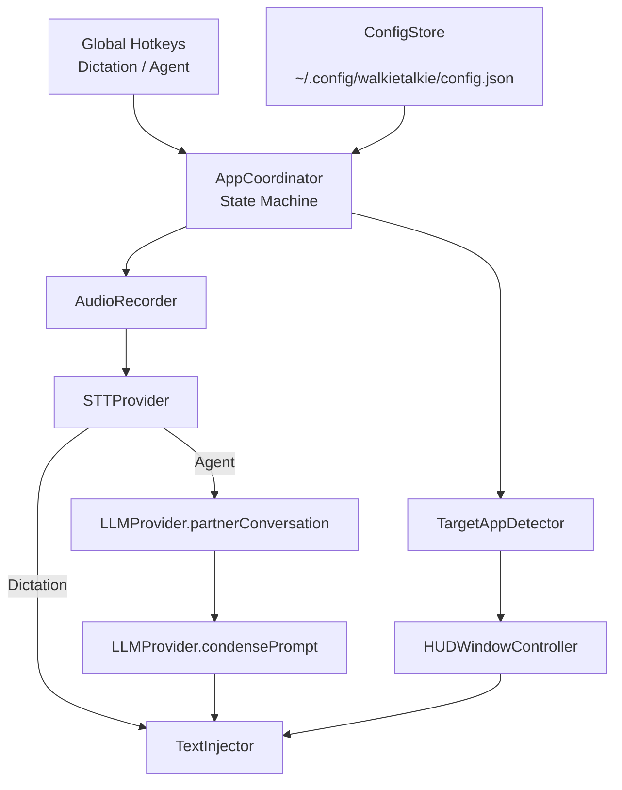

# walkietalkie (macOS MVP)

A global push-to-talk voice layer that runs **alongside** Codex CLI / Claude Code / any TUI in any terminal app. It never wraps PTYs and never becomes the coding agent entrypoint.

## Install (No `swift run`)
```bash
/bin/bash -c "$(curl -fsSL https://raw.githubusercontent.com/keepgoingcari/walkietalkie/main/scripts/install.sh)"
walkietalkie setup
walkietalkie
```

If macOS blocks launch with "Apple could not verify":
```bash
xattr -dr com.apple.quarantine "$(which walkietalkie)"
```
Long-term production fix is Developer ID signing + notarization.

## Signing + Notarization (Release)
One-time credential setup:
```bash
xcrun notarytool store-credentials "walkietalkie-notary" \
  --apple-id "you@example.com" \
  --team-id "YOUR_TEAM_ID" \
  --password "APP_SPECIFIC_PASSWORD"
```

Per release:
```bash
export SIGN_IDENTITY="Developer ID Application: Your Name (TEAMID)"
export NOTARY_PROFILE="walkietalkie-notary"
./scripts/release_notarize.sh /path/to/Walkietalkie.app
./scripts/release_verify.sh /path/to/notarized/Walkietalkie.app
```

## Stack
- Swift 6 + SwiftUI + AppKit menu bar app (macOS 13+)
- Carbon global hotkeys (press/release for hold-to-talk)
- AVFoundation audio capture
- Pluggable cloud STT + LLM adapters (mock default; OpenAI stubs included)
- Accessibility + clipboard injection (Cmd+V + optional Enter + typed fallback)

## Architecture Diagram


## UX State Machine
```text
Idle
  -> (hotkey pressed) Listening(mode)
  -> (hotkey released) Transcribing(mode)
  -> (if mode=agent) AgentConversation -> Condensing
  -> Injecting(target app, HUD confirm/cancel)
  -> Done -> Idle
  -> Error -> Idle

Cancel path:
  Any state --Esc/cancel--> Idle
```

## Repo Structure
```text
walkietalkie/
  Package.swift
  README.md
  config.example.json
  Sources/walkietalkie/
    App/
      WalkieTalkieApp.swift
      AppCoordinator.swift
      AppStateMachine.swift
    Core/
      Errors.swift
    Models/
      Config.swift
    Services/
      KeychainStore.swift
      EventLogger.swift
      ConfigStore.swift
      HotkeyManager.swift
      AudioRecorder.swift
      STTProviders.swift
      LLMProviders.swift
      TargetAppDetector.swift
      HUDWindowController.swift
      TextInjector.swift
    CLI/
      WalkieCLI.swift
    main.swift
    UI/
      HUDView.swift
```

## MVP Scope Implemented
- Two configurable global push-to-talk hotkeys:
  - `dictation`
  - `agent`
- Dictation mode:
  - hold -> record -> transcribe -> inject raw text
- Agent mode:
  - hold -> record -> transcribe -> partner reasoning call -> condensed final prompt -> inject
- Universal frontmost-app injection:
  - clipboard snapshot -> set text -> Cmd+V -> optional Enter -> clipboard restore
  - fallback typed keystrokes if synthetic paste path throws
- Frontmost app behavior:
  - detects app name/bundle ID
  - allows inject-anywhere or allowlist gate
  - HUD shows target app and allows cancel via Esc
- Config load/save + validation from:
  - `~/.config/walkietalkie/config.json`

## Config Keys
- `hotkeys.dictation`, `hotkeys.agent`:
  - `key`: `space`, `a-z`, `return`, `tab`, `escape`
  - `modifiers`: `command`, `control`, `option`, `shift`
- `modeBehavior.dictation.autoEnter`
- `modeBehavior.agent.autoEnter`
- `injection.injectAnywhere`
- `injection.allowlistBundleIDs`
- `injection.preInjectHUDMillis`
- `injection.fallbackToKeystrokesOnFailure`
- `stt.provider`: `mock` or `openai`
- `llm.provider`: `mock` or `openai`

## Run
```bash
cd /Users/cari/src/walkietalkie
swift run
```

## Onboarding CLI
Use the same binary for setup and diagnostics:
```bash
cd /Users/cari/src/walkietalkie
swift run walkietalkie -- setup
swift run walkietalkie -- doctor
swift run walkietalkie -- logs --tail 120
```

When packaged, this becomes:
```bash
walkietalkie setup
walkietalkie doctor
```

Setup wizard configures:
- STT/LLM provider selection
- OpenAI API key storage in macOS Keychain
- Dictation and agent hotkeys
- Auto-enter behavior
- Inject-anywhere vs allowlist policy

On first real use, macOS should request permissions:
- Microphone access
- Accessibility access (for synthetic key events)

## Implementation Steps (Order)
1. Build app shell + menu bar lifecycle.
2. Add config store + validation + hotkey parsing.
3. Add global hotkey press/release handling.
4. Add audio capture for hold-to-talk.
5. Add STT/LLM pluggable adapters.
6. Add frontmost-app detection + policy gate.
7. Add HUD confirm/cancel before injection.
8. Add clipboard-safe universal injection + fallback typing.
9. Wire full state machine and cancellation.
10. Add observability/logging + provider hardening (next).

## Edge Cases + Mitigations
- Frontmost app is not terminal:
  - allowed by default (`injectAnywhere=true`)
  - can enforce allowlist (`injectAnywhere=false` + `allowlistBundleIDs`)
  - HUD always shows target app and supports Esc cancel.
- Secure input / synthetic event blocked:
  - paste path throws -> typed fallback attempted.
  - if both blocked, error shown in menu state.
- Focus not in input field:
  - still injects where focus is.
  - HUD gives target reminder before inject; cancel quickly with Esc.
- Clipboard safety:
  - snapshot/restore all pasteboard item data types in `defer`.
- Cloud latency:
  - explicit HUD status transitions (Transcribing, Partner, Condensing).
- User cancels mid-stream:
  - Esc/cancel sets cancellation flag, stops recording, returns to Idle.
- Long text:
  - default paste path handles large payload better than keystroke typing.
  - typed fallback is only used when paste path errors.

## Non-required Fast Paths (Post-MVP)
- iTerm2 API fast injection path.
- VS Code extension bridge for terminal/editor awareness.
- Structured terminal prompt detection via AX tree for better “not in prompt” hints.
- Streaming STT + partial transcript HUD.
- Local on-device STT option.

## Homebrew Packaging
A formula template is included at:
- `packaging/homebrew/Formula/walkietalkie.rb`

A cask template is included at:
- `packaging/homebrew/Casks/walkietalkie.rb`

Release flow:
1. Tag a release (`vX.Y.Z`) and push tag.
2. Generate source tarball + sha:
```bash
./scripts/create_release_artifacts.sh X.Y.Z
```
3. Upload artifact to GitHub release.
4. Update formula `url` and `sha256`.
5. Push formula to your tap repo.
6. Install with:
```bash
brew tap keepgoingcari/walkietalkie
brew install walkietalkie
```
